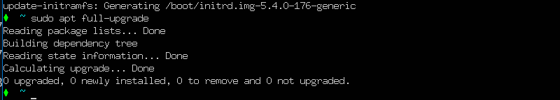
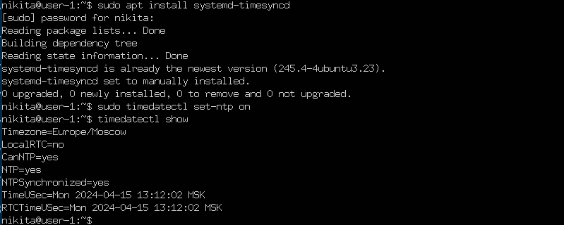
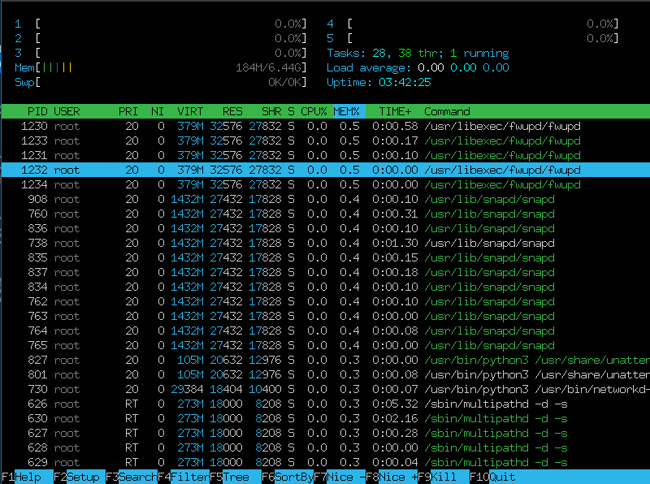

## Contents
1. [Part 1](#part-1-installation-of-the-os)
2. [Part 2](#part-2-creating-a-user)
3. [Part 3](#part-3-setting-up-the-os-network)
4. [Part 4](#part-4-os-update)
5. [Part 5](#part-5-using-the-sudo-command)
6. [Part 6](#part-6-installing-and-configuring-the-time-service)
7. [Part 7](#part-7-installing-and-using-text-editors)
8. [Part 8](#part-8-installing-and-basic-setup-of-the-sshd-service)
9. [Part 9](#part-9-installing-and-using-the-top-htop-utilities)
10. [Part 10](#part-10-using-the-fdisk-utility)
11. [Part 11](#part-11-using-the-df-utility)
12. [Part 12](#part-12-using-the-du-utility)
13. [Part 13](#part-13-installing-and-using-the-ncdu-utility)
14. [Part 14](#part-14-working-with-system-logs)
15. [Part 15](#part-15-using-the-cron-job-scheduler)

## Part 1. Installation of the OS

<!-- **== Task ==**
##### Install **Ubuntu 20.04 Server LTS** without GUI. (Use VirtualBox). -->

- Уcтановил [VirtualBox](https://www.virtualbox.org/wiki/Downloads)
- Установил [Ubuntu 20.04 Server LTS without GUI](https://releases.ubuntu.com/20.04/)
- В комндной строке операционной системы Ubuntu выполнил команду \
    `cat /etc/issue`

- Add a screenshot of the command output

## Part 2. Creating a user

<!-- **== Task ==**
##### Create a user other than the one created during installation. The user must be added to `adm` group. -->

- Создал ползователя и добавил его в группу adm \
    `sudo adduser nikita`
    `sudo nikita -a -G adm nikita`

- Add a screenshot of command call to create user

- Проверил создался ли пользователь с именем nikita
    `cat /etc/passwd`

- Add a screenshot of the command output 

## Part 3. Setting up the OS network

- Зададим имя машины в Linux user-1
    `sudo hostnamectl set-hostname user-1`
- Проверяем имя хоста 
    `cat /etc/hostname`

- 

- Установить временную зону, соответствующую вашему текущему местоположению
    `sudo timedatectl set-timezone Europe/Moscow`
- Проверка временной зоны
    `timedatectl`

- 

- Вывел названия сетевых интерфейсов с помощью консольной команды
    `ip address` or `ls /sys/class/net`

- Output the names of the network interfaces

- \> *lo (loopback device) – виртуальный интерфейс, присутствующий по умолчанию в любом Linux. Он используется для отладки сетевых программ и запуска серверных приложений на локальной машине. С этим интерфейсом всегда связан адрес 127.0.0.1. У него есть dns-имя – localhost. Посмотреть привязку можно в файле /etc/hosts.*

- Выполнил команду для получения ip-адреса от DHCP сервера
    `sudo dhclient enp0s3` or `ip r`

- Output the consol comand `sudo dhclient enp0s3` and `ip r`

- \> *DHCP — протокол прикладного уровня модели TCP/IP, служит для назначения IP-адреса клиенту. Это следует из его названия — Dynamic Host Configuration Protocol. IP-адрес можно назначать вручную каждому клиенту, то есть компьютеру в локальной сети. Но в больших сетях это очень трудозатратно, к тому же, чем больше локальная сеть, тем выше возрастает вероятность ошибки при настройке. Поэтому для автоматизации назначения IP был создан протокол DHCP.*

- Выполнил команду для вывода внешнего ip шлюза, и для вывода внутреннего
    `wget eth0.me` and `cat index.html` and `ip route show default`

- 

- Задал статичные (заданные вручную, а не полученные от DHCP сервера) настройки ip, gw, dns (использовал публичный DNS серверы 1.1.1.1 )
    `nano /etc/netplan/00-installer-config.yaml` and `sudo netplan apply`

- Set static ip, gw, dns settings                        

- Перезапуcтил машину командой 
    `reboot`
- Пинганул 1.1.1.1 и ya.ru 
    `ping 1.1.1.1`
    `ping ya.ru`

- 

## Part 4. OS Update

- Получил доступные пакеты `sudo apt update`
- Обновил систему командой  `sudo apt full-update`

- 

## Part 5. Using the sudo command

- \> *Sudo (su «do») позволяет системному администратору делегировать полномочия, чтобы дать определенным пользователям (или группам пользователей) возможность запускать некоторые (или все) команды от имени пользователя root или другого пользователя, обеспечивая контрольный журнал команд и их аргументов.*

- Добавил ползователя в группу sudo `sudo usermod -a -G sudo new_user`
- Cменил пользователя `su - nikita`
- Поменял имя хоста `sudo hostnamectl set-hostname user-2`
- Посмотрел имя хоста командой `cat /etc/hostname`

- 

## Part 6. Installing and configuring the time service

- Установил NTP (сетевой протокол времени) `sudo apt install systemd-timesyncd`
- Активируем NTP командой `sudo timedatectl set-ntp on`
- Посмотрел текущие настройки `timedatectl show`

- 

## Part 7. Installing and using text editors

#### 1_VIM
- Создал файл с помощью команды `vim` `test_vim.txt`
- Нажал `i` для перехода в режим редактирования
- Написал ник: `elishabr`
- Для выхода с сохранением нажимем `Esc` вводим команду `:wq` и нажимаем `Enter`

- 

#### 1_NANO
- Создал файл с помощью команды `nano` `test_nano.txt`
- Написал ник: `elishabr`
- Для выхода нажимаем комбинацию `ctrl+x` для сохранения вводим `Y` и нажимаем `Enter`

- 

#### 1_MCEDIT
- Создал файл с помощью команды `mcedit` `test_mcedit.txt`
- Написал ник: `elishabr` 
- Для выхода с сохранением нажимем `Esc` затем клавишу `YES`

- 

#### 2_VIM 
- Открываем файл с помощью команды `vim` `test_vim.txt`
- Нажимаем `i` для перехода в режим редактирования
- Изменяем ник на `21 School 21`
- Для выхода без сохранения нажимаем `Esc` вводим команду `:q!` и нажимаем `Enter`

- 

#### 2_NANO
- Открываем файл с помощью команды `nano` `test_nano.txt`
- Изменяем ник на `21 School 21`
- Для выхода без сохранения нажимаем комбинацию ctrl+x, потом N

- 

#### 2_MCEDIT
- Открываем файл с помощью команды `mcedit` `test_mcedit.txt`.
- Изменяем ник на `21 School 21`
- Для выхода без сохранения нажимаем `Esc`, а затем `No`

- 

#### 3_VIM
- Открываем файл с помощью команды `vim` `test_vim.txt`
- Для поиска в `VIM` вводим `/elishabr` и искомое слово выделяется в самом редакторе

- 

- Для замены слова в VIM вводим `:%s/elishabr/21 School 21` и слово `elishabr` заменяется на `21 School 21`

- 

#### 3_NANO
- Открываем файл с помощью команды `nano` `test_nano.txt`
- Для поиска в `NANO` вводим `ctrl + W`

- 

- Для замены слова в `NANO` вводим `ctrl + \`, пишем `elishabr`, нажимаем `Enter`, пишем `21 School 21`, нажимаем `Enter`, выбираем `Y`

- 

#### 3_MCEDIT
- Открываем файл с помощью команды `mcedit` `test_mcedit.txt`
- Для поиска в `mcedit` вводим `F7`, затем вводим слово, которое хотим найти, оно выделяется зеленым

- 

- Для замены слова в `mcedit` жмем `F4`, затем вводим `elishabr`, нажимаем стрелку вниз, пишем `21 School 21`

- 

## Part 8. Installing and basic setup of the SSHD service
- Устанавливаем службу `SSHd` командой `sudo apt install openssh-server`
- Проверяем наличие командой `ssh -V`

- 

- Добавляем автостарт службы `SSHd` командой `sudo update-rc.d ssh defaults`
- Открываем config `sudo vim /etc/ssh/sshd_config`
- Изменяем порт `SSHd` добавляем строку `Port 2022`
- Перезапустить SSHd командой `service sshd restart`

- 
- 

- Используем команду `ps -af | grep sshd` для проверки наличия процесса 
    - Команда `ps` показывает текущие процессы на сервере.
    - Команда `grep` позволяет выдилить нужную нам информацию по процессам
    - флаг `-f` выводит полноформатный список
    - флаг `-e` выводит все системные процессы

- 

- Устанавливаем `net-tools` `sudo apt install net-tools`
- Выполняем команду `netstat -tan`

- 

- \> *Выполнение команды `netstat -tan`*
    - Опция `-a` показывает состояние всех сокетов
    - `-n` показывает ip адрес, а не сетевое имя
    - `-t` показывает только tcp соединения
    - Столбец `Proto` - протокол, используемый сокетом
    - Столбец `Recv-Q` - количество байтов, не скопированных пользовательской программой, подключенной к этому сокету
    - Столбец `Local Adbress` - локальный адрес (имя локального хоста) и номер порта сокета
    - Столбец `Foreign Adbress` - удаленный адрес (имя удаленного хоста) и номер порта сокета
    - Столбец `State` - состояние сокета
    - 0.0.0.0 в выводе netstat означает, что ssh daemon прослушивает все интерфейсы `IPv4`, которые есть у машины
- Перезагружаем систему командой `sudo reboot`

## Part 9. Installing and using the top, htop utilities
- Командой `top` запускаем соответствующую утилиту

- 

- Запуск `top`
    - `uptime`, количество авторизированных пользователей, общая загрузка системы  
    
    - общее количество процессов  
    
    - загрузка cpu  
    
    - загрузка памяти  
    
    - pid процесса, занимающего больше всего памяти  
    
    - pid процесса, занимающего больше всего процессорного времени  
    
    - Жмем `q` для выхода из `top`
- Командой `htop` запускаем утилиту

- 

- Запуск `htop`
    - PERCENT_CPU  
    
    - PERCENT_MEM  
    
    - TIME  
    

- Для работы с фильтром нажимаем `F4`
- После мы вводим SShd и нажимаем `Enter`

- 

- Для работы с поиском нажимаем `F3`
- После мы вводим `syslog` и нажимаем `Enter`

- 

- Выход `F10`

## Part 10. Using the fdisk utility
- Запуск утилиты командой `sudo fdisk -l`
- Название жесткого диска VBOX HARDDISK, количество секторов 5248800, размер 25 Гб

- 

- Используем команду `free -h` для определения размера `swap`

- 

## Part 11. Using the df utility
- Запуск утилиты командой `df -h /`

    - 
    - `h` вывод в гигобайтах
    - `/` корневого раздела
- Запуск утилиты командой `df -Th /`

    - 
    - `T` добавляет поле с типом файловой системы, в нашем случае это `ext4`

## Part 12. Using the du utility
- Запуcк команды du
- С помощью команды `sudo du -sh /home && sudo du -sh /var && sudo du -sh /var/log` выводим размер папок
    - `-s` показывает только общий размер папки 
    - `-h` удобочитаймый вид
- 

- Вывести размер элементов `/var/log` с помощью команды `sudo du -sh /var/log*`
- 

## Part 13. Installing and using the ncdu utility
- Вывести размер папок с помощью команды `sudo ncdu` `/home`, `/var`, `/var/log`

- /var/log  

- /home  

- /var  

## Part 14. Working with system logs
- Просмотр `vim /var/log/dmesg`  

- Просмотр `vim /var/log/syslog`  

- Просмотр `vim /var/log/auth.log`  

- Для просмотра последней авторизации, имени пользователя и метода входа в систему используем команду `last`  
  
- Время авторизации `Apr 18 11:18`, имя пользователя `elishabr`, метод входа в систему `tty1`

- Командой `service sshd restart` перезапускаем службу `SSHd`  

- Командой `sudo cat /var/log/syslog` выводим сообщение о рестарте служб  

## Part 15. Using the CRON job scheduler
- Используем команду `sudo apt install cron` для установки `CRON`
- Планируем задачу командой `crontab -e`
- В vim приписываем `*/2 * * * * /usr/bin/uptime`
- Командой `crontab -l` выводим список установленых задач   
- 
- 

- Командой `crontab -l` удаляем все запланированые задачи
- Проверяем список задач ещё раз
- 
