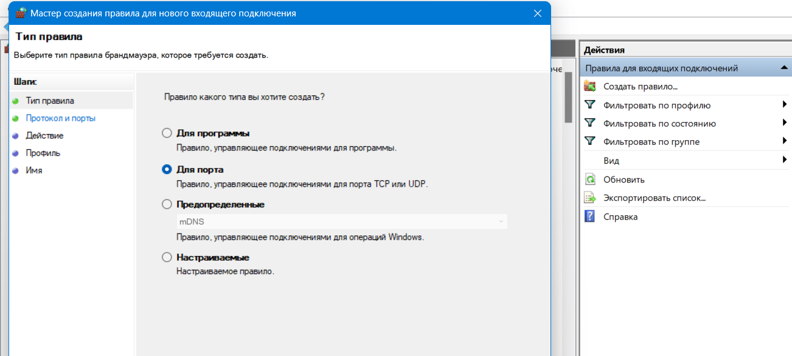
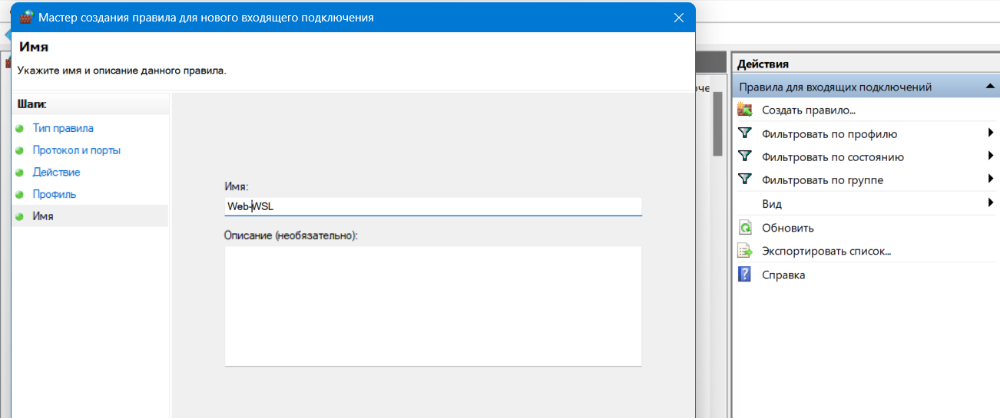

## Инструкция для запуска Dockerfile

- Собери написанный докер-образ через docker build при этом указав имя и тег.
    \>* . указывает на то, что Dockerfile находится в текущей дериктории. mini-server:1.0 это <имя>:<тег> образа* 
```
    docker build -t mini-server:1.0 .
```
- Проверь через `docker images`, что все собралось корректно.
- Запусти собранный докер-образ с маппингом 81 порта на 80 на локальной машине и маппингом папки ./nginx внутрь контейнера по адресу, где лежат конфигурационные файлы nginx'а
```
    docker run -d -p 80:81 -v /etc/nginx:/etc/nginx mini-server:1.0
```
- Откройте командную строку в запущеного контейнера с помощью команды 
```
    docker exec -ti <имя_контейнера> bash
```
- В открывшейся строке запустить скрипт `bash script_for_image.sh`
- Открыыть в браузере `localhost:80`
## Как получить доступ к службам работающим внутри WSL2 c других устройств вашей локальной сети
- Этот скрипт использует команду netsh interface portproxy в Windows для настройки прокси-соединения между двумя адресами IPv4. В данном случае, он создает правило проксирования для порта 3000.
```
    netsh interface portproxy add v4tov4 `
    listenport=3000 `
    listenaddress=0.0.0.0 `
    connectport=80 connectaddress=<ip_wsl_whit_mini-server>
```
- Проверим результат 
```
    netsh interface portproxy show all
```
- Добавим правило `брандмаура` чтобы открыть порт на хост компьюторе 
```
    wf
```
- Скриншоты с начтройкой  `брандмаура`
\> *Кликаем на создать правило*
- 
\> *Выбираем правило для порта*
- 
\> *Задаем порт 80 - в нашем случае надо задать 3000 порт*
- 
\> *Со всем соглашаемся и придумываем имя правилу*
- 
## Результат задания четвертого
- 