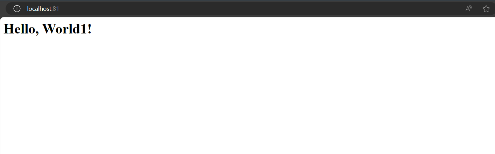

## Полезные статьи 

- [nginx](https://nginx.org/ru/docs/beginners_guide.html)
- [working with nginx in ubuntu](https://timeweb.cloud/tutorials/ubuntu/kak-ustanovit-nginx-na-ubuntu)
- [video with settings](https://www.youtube.com/watch?v=WBzCg-mywWQ)

## Запуск сервера FastCGI на Ubuntu и проксирование его через Nginx

```(.sh)
    #!/bin/bash
    sudo apt update
    sudo apt install nginx
    sudo systemctl start nginx
    sudo service nginx status
    sudo cp nginx/nginx.conf /etc/neginx/sites-avalable/blog.local
    # создаем сивольную ссылку для привязки нашей конфигурации nginx.conf
    sudo ln -s /etc/neginx/sites-avalable/blog.local /etc/nginx/sites-enabled
    # проверка конфигурации nginx
    sudo nginx -t
    sudo systemctl restart nginx
    gcc -Werror -Wextra -Wall server.c -o server1 -lfcgi
    # запусскаем server1 на localhost:8080
    spawn-fcgi -p 8080 server1
```
## Результат выполнения файла script.sh

