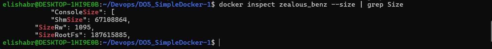

## Contents
1. [Part 1]()

## Part 1. Ready-made docker
- Взять официальный докер образ с nginx и выкачать его при помощи `docker pull`
    \> *Вывод команды `docker pull`*
- 
- Проверить наличие докер образа через `docker images`
    \> *Вывод команды `docker images`*
- 
- Запустить докер образ через `docker run -d [image_id|repository]`
    \> *Вывод команды `docker run -d [image_id|repository]`*
- 
- Проверить, что образ запустился через `docker ps`
    \> *Вывод команды `docker ps`*
- 
- Посмотреть информацию о контейнере через `docker inspect [container_id|container_name]`
    \> *Вывод команды `docker inspect [container_id|container_name]`*
- 
- По выводу команды определить и поместить в отчёт размер контейнера, список замапленных портов и ip контейнера
    ```
        container size -> ( "ShmSize": 67108864, "SizeRw": 1095, "SizeRootFs": 187615885)
        list of mapped ports -> (  "80/tcp": null )
        container ip -> ( "172.17.0.2" )
    ```
-  \> *container size*
-  \> *list of mapped ports*
-  \> *container ip*
- Остановить докер образ через `docker stop [container_id|container_name]`
    \> *Вывод команды `docker stop [container_id|container_name]`*
- 
- Проверить, что образ остановился через docker ps
    \> *Вывод команды `docker ps`*
- 
- Запустить докер с портами 80 и 443 в контейнере, замапленными на такие же порты на локальной машине, через команду run
    \> *Вывод команды `docker run -d -p 80:80 -p 443:443 [image_id|repository]`*
- 
Проверить, что в браузере по адресу `localhost:80` доступна стартовая страница nginx
    \> *В браузере на `localhost:80`*
- 
- Перезапустить докер контейнер через `docker restart [container_id|container_name]`
- Проверить любым способом, что контейнер запустился
    \> *Вывод команды `docker restart [container_id|container_name]` и проверка, что контейнер запущен*
- 
## Part 2. Operations with container
- Преред выполнением задания ознакомился с [nginx](https://nginx.org/en/docs/beginners_guide.html)
- Прочитать конфигурационный файл nginx.conf внутри докер контейнера через команду exec
    \> *Вывод команды `docker exec [container_id|container_name] cat /etc/nginx/nginx.conf`*
- 
- Создать на локальной машине файл nginx.conf
- Настроить в нем по пути `/status` отдачу страницы статуса сервера nginx.
    \> *Содержимое созданного файла `nginx.conf` на локальной машине*
- 
- Скопировать созданный файл nginx.conf внутрь докер образа через команду `docker cp ./nginx.conf [container_id|container_name]:/etc/nginx/nginx.conf`
- Перезапустить nginx внутри докер образа через команду `docker exec [container_id|container_name] nginx -s reload`
    \> *Вывод команд `docker cp ./nginx.conf [container_id|container_name]:/etc/nginx/nginx.conf` и `docker exec [container_id|container_name] nginx -s reload`*
- 
- Проверить, что по адресу `localhost:80/status` отдается страничка со статусом сервера nginx
    \> *Результат запроса GET в браузере по `URL` `localhost:80/status`*
- 
- Экспортировать контейнер в файл `container.tar` через команду `export`
- Остановить контейнер
    \> *Вывод команд `docker export [container_id|container_name] > container.tar` и `docker stop [container_id|container_name]`*
- 
- Удалить образ через `docker rmi -f [image_id|repository]`, не удаляя перед этим контейнеры.
    \> *Вывод результата команды*
- 
- Удалить остановленный контейнер
    \> *Вывод результата команды `docker rm [container_id|container_name]`*
- 
- Импортировать контейнер обратно через команду `import`
- \> *Помните, что при импорте контейнера обратно в образ вы теряете историю и метку образа, а также любые переменные окружения и данные о состоянии, которые были сохранены в контейнере.*
- Флаги для запуска `nginx` в команденой строке `cmd` -> (`-c 'cmd ["nginx", "-g", "daemon off;"]'`)
    \> *Вывод результата команды `docker import -c 'cmd ["nginx", "-g", "daemon off;"]' container.tar nginx`*
- 
- Запусти импортированный контейнер `docker run -d -p 80:80 -p 443:443 [container_id|container_name]`
    \> *Вывод результата команды `docker run -d -p 80:80 -p 443:443 [container_id|container_name]`*
- 
- Проверим, что по адресу `localhost:80/status` отдается страничка со статусом сервера nginx.
    \> *Результат запроса GET в браузере по `URL` `localhost:80/status`*
- 
