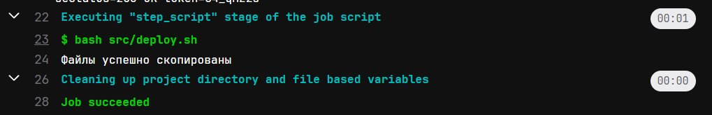
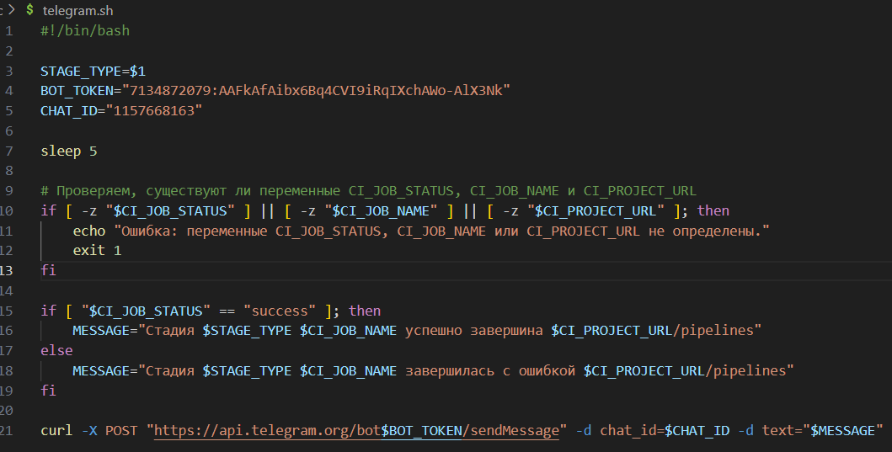

# Basic CI/CD

## Contents

1. [Part1](#part-1-настройка-gitlab-runner)
2. [Part2](#part-2-сборка)
3. [Part3](#part-3-тест-кодстайла)
4. [Part4](#part-4-интеграционные-тесты)
5. [Part5](#part-5-этап-деплоя)
6. [Part6](#part-6-дополнительно-уведомления)

## Немного теории
- CI/CD - методика непрерывной интеграции и доставки контента
- Разделяется два процесса - CI (Continuous Integration) и CD (Continuous Delivery)
- Представляет собой автоматизированный процесс от разработки и тестов до разворачивания в продакшн
    - CI - практика разработки программного обеспечения, выполнение сборок, выявление дефектов и решение проблем
    - CD - подход к разработке программного обеспечения, передача стабильного ПО в эксплуатацию
    - Runner - по, предназначенное для автоматизизации выполнения заданий
- \> *Например: Производятся обновления в проектах - `git push` Последующее внесение изменений на серверах, например синхронизация файлов*

## Part 1. Настройка gitlab-runner
- Подними виртуальную машину Ubuntu Server 22.04 LTS.  
- \> *Скриншот с версией Ubuntu Server*
- 
- Скачай и установи на виртуальную машину [gitlab-runner](https://docs.gitlab.com/runner/install/linux-repository.html).   
- \> *Настройка репозитория Debian / Ubuntu:
`curl -L "https://packages.gitlab.com/install/repositories/runner/gitlab-runner/script.deb.sh" | sudo bash`*
-    
- \> *Установка раннера Debian / Ubuntu: `sudo apt install gitlab-runner`*
- 
- Запусти gitlab-runner `sudo systemctl enable gitlab-runner --now gitlab-runner` и зарегистрируй его для использования в текущем проекте (DO6_CICD)  
- \> *Для регестрации вызываем команду [gitlab-runner register](https://docs.gitlab.com/runner/commands/#interactive-registration)  и заполняем поля name, url, registration-token.*   
- \> *Последним пунктом он предлогает выбрать среду исполнения ваших команд "pipeline" (конвейер), мы выбрали shell*  
- \> *Перезапустите сервис `sudo systemctl restart gitlab-runner`*
- 
## Part 2. Сборка
- [CI/CD простой проект](http://snakeproject.ru/rubric/article.php?art=gitlab_31012022)
- Напиши этап для CI по сборке приложений из проекта C2_SimpleBashUtils.
    - В файле gitlab-ci.yml добавь этап запуска сборки через мейк файл из проекта C2.
    - Файлы, полученные после сборки (артефакты), сохрани в произвольную директорию со сроком хранения 30 дней.
- Скопировал папки cat и grep из проекта SimpleBashUtils в папку src проекта CICD:
- Cоздал и описал файл .gitlab-ci.yml
    - Файл .gitlab-ci.yml - это файл конфигурации для настройки и определения задач и пайплайнов непрерывной интеграции и непрерывной доставки (CI/CD) в GitLab. В этом файле вы описываете, какие шаги должны выполняться автоматически при каждом пуше кода в ваш репозиторий. После добавления .gitlab-ci.yml файла в ваш репозиторий, GitLab CI/CD будет автоматически создавать пайплайны и выполнять задачи согласно вашим настройкам. Вы сможете видеть результаты выполнения задач в веб-интерфейсе GitLab, а также настраивать уведомления, автоматическое развертывание и другие аспекты CI/CD процесса.
- Простейший формат сценария yml:
    ```
        stages: 
        - имя_шага_1
        - имя_шага_2
        название_задачи_1
        stage: имя_шага_1
        tags:
            - имя_тега_1
            - имя_тега_2
        script:
            - команда_1
            - команда_2
        stage: имя_шага_2
        script:
            - команда_1
            - команда_2
        artifacts:
            paths:
                - что_вернуть_на_сервер_с_gitlab
    ```
- /> *Содержание сценария yml для выполнения сборки проекта*
- 
## Part 3. Тест кодстайла
- Напиши этап для CI, который запускает скрипт кодстайла (clang-format).
    - Если кодстайл не прошел, то «зафейли» пайплайн.
    - В пайплайне отобрази вывод утилиты clang-format.
  
- \> *Дополним файл .yml c задачей на код стайл*
-   
- \> *В случае успеха конвеир будет завершон, при ошибке он будет прерван*
- 
## Part 4. Интеграционные тесты
- Напиши этап для CI, который запускает твои интеграционные тесты из того же проекта.
    - Запусти этот этап автоматически только при условии, если сборка и тест кодстайла прошли успешно.
    - Если тесты не прошли, то «зафейли» пайплайн.
    - В пайплайне отобрази вывод, что интеграционные тесты успешно прошли / провалились.
  
- \> *Дополним файл .yml c задачей на запуск интеграционных тестов*
- 
- \> *Запуск этапа автоматически только при условии, если сборка и тест кодстайла прошли успешно*
- 
- \> *В пайплайне отображается вывод, что интеграционные тесты прошли успешно / провалились*
- 
## Part 5. Этап деплоя
#### Напиши этап для CD, который «разворачивает» проект на другой виртуальной машине.
- Подними вторую виртуальную машину Ubuntu Server 22.04 LTS
- 
- Соидинить VM-1 и VM-2 в одну виртуальную сеть
- 
- разворачивание проекта на другой машине будет осуществлятся через ssh туннель.Для этого нужно установить ssh-server
- ключевая сложность этого этапа это права доступа. Каждый раз запуская скрипт нам требуется доступ к папкам на удаленном сервере. Все работы выполняет `gitlab-runner` через своего одноименного пользователя. Необходимо на сервере где запущен `gitlab-runner` сменить пользователя на `gitlab-runner` командой `su - gitlab-runner`, далее сгенерировать `ssh-keygen` ключ. Полученный ключ необходимо внести в файл `/.ssh/authorized_keys` на удаленном сервере командой `ssh-copy-id user@host` и если возникает ошибка доступа при переноса файлов, нужно делать пользователя, под которым заходишь на вторую машину владельцем директории в которую переносишь файлы `sudo chown -R $(whoami)-это_заменяется_системой_на_имя_текущего_пользователя`, или просто поменять права папки. Если вы не помните пароль `gitlab-runner` его можно сменить командой `sudo passwd gitlab-runner`  
- \> *Теперь к удаленному серверу можно присоидинятся по ssh без необходимости ввода пароля.*
- 
- \> *Вход на удаленный сервер без пароля*
- 
- Запусти этот этап вручную при условии, что все предыдущие этапы прошли успешно.
    ```
        # Добавим для этого правило в фаил .yml
        when: manual
    ```
- Напиши bash-скрипт, который при помощи ssh и scp копирует файлы, полученные после сборки (артефакты), в директорию /usr/local/bin второй виртуальной машины. Тут тебе могут помочь знания, полученные в проекте DO2_LinuxNetwork.
- 
- В файле gitlab-ci.yml добавь этап запуска написанного скрипта.
- 
- \> *Изменил владельца папки /usr/local/bin с root на elishabr командой `sudo chown -R $(whoami) /usr/local/bin` иначе у пользователя небыло прав на редактирования этого каталога*
- 
- В случае ошибки «зафейли» пайплайн. В результате ты должен получить готовые к работе приложения из проекта C2_SimpleBashUtils (s21_cat и s21_grep) на второй виртуальной машине.
- 
- \>*Рузультат успешного выполнения развертывания проекта на удаленном сервере*
- 
## Part 6. Дополнительно. Уведомления
#### Настрой уведомления о успешном/неуспешном выполнении пайплайна через бота с именем «[твой nickname] DO6 CI/CD» в Telegram.
- [Докуметация по настройке телеграм-бота](https://docs.gitlab.com/ee/user/project/integrations/telegram.html)
- первым делом необходимо получить токен бота. Для этого используем инфраструктуру телеграма, а точнее главного бота "BotFather".
- 
- [Далее необходимо получить id чата](https://telegram-bot-sdk.readme.io/reference/getupdates). Для этого в адресной строке браузера забиваем `https://api.telegram.org/bot<YOUR_BOT_TOKEN>/getUpdates`, уже находясь на указанной странице отправьте любое сообщение в чат бота. На странице отобразятся данные, включая id чата в который вы отправили сообщение (поле chat->id):
- 
- Написал скрипт `telegram.sh` для отправки собщений в чат телеграмма через API бота
- 
- Изменил фаил .yml. Добавил выполнение скрипта telegram.sh
- 
- Текст уведомления должен содержать информацию об успешности прохождения как этапа CI, так и этапа CD.
- В остальном текст уведомления может быть произвольным.
- \> *Результат проделанной работы*
- 